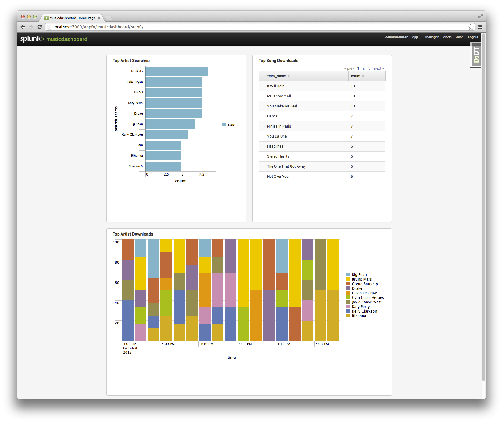
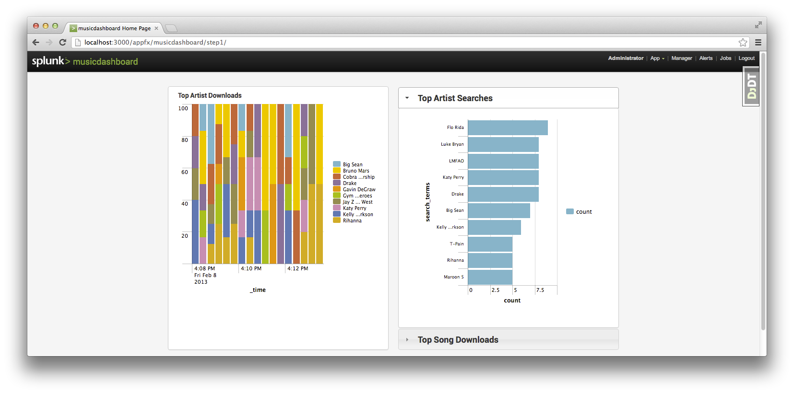
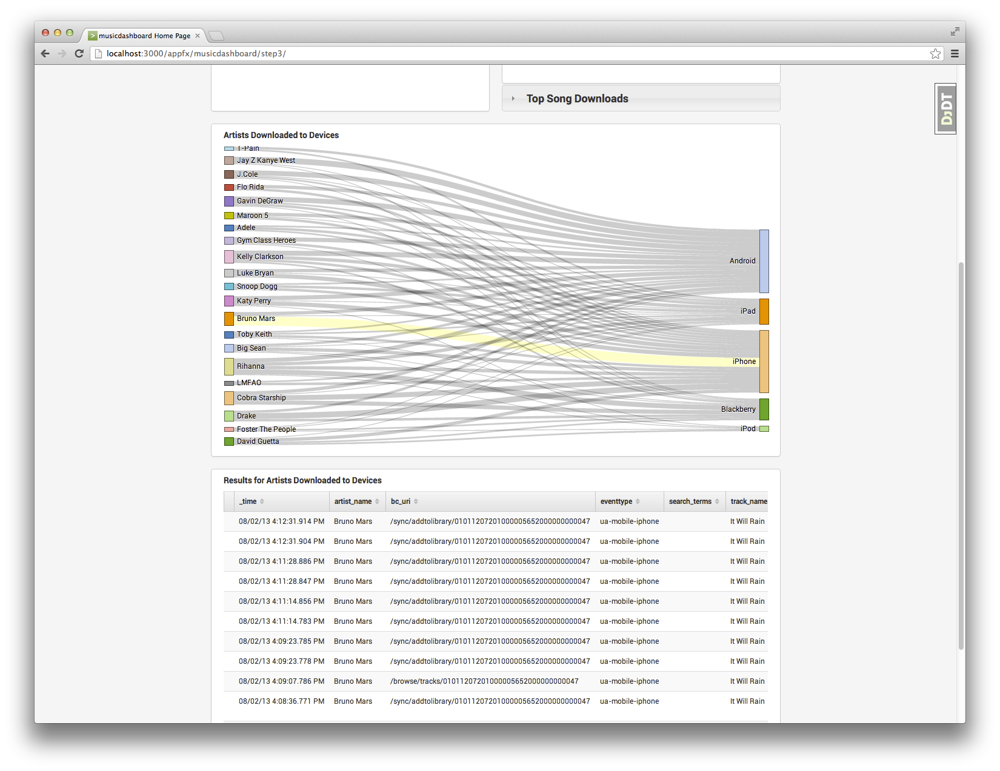
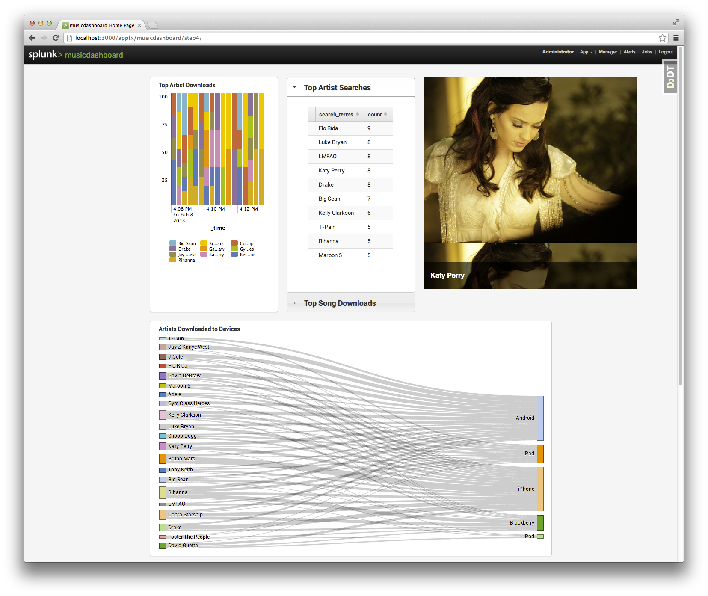

# Diving into the new Splunk App Framework

As mentioned in previous posts, the recently-released preview of the 
[new Splunk App Framework](http://dev.splunk.com/view/app-framework/SP-CAAAEMA)
allows developers to draw from the power of modern web programming to create
new and exciting applications built on Splunk. I'm really excited about all
the new abilities the framework provides, and I think it will help usher in 
some really awesome Splunk Apps. 

When I first got my hands on the framework, I wanted to show off how quickly
and easily a web developer, such as myself, could use standard web technologies to make a simple yet compelling dashboard for Splunk. 

Let's get started!

## Setup
If you haven't already, you'll first need to grab the Splunk App Framework
from GitHub. To get yourself set up, get over to 
[the Splunk App Framework GitHub repo](https://github.com/splunk/splunk-appframework) 
and follow the instructions on that page.

Once you've gotten the framework set up, create a new empty app and start the 
framework by entering:

    ./appfx createapp musicdashboard 

You'll need to provide your Splunk login credentials. Then, enter:
    
    ./appfx run

Navigate to **$APPFRAMEWORK_HOME/server/apps/musicdashboard** and update the 
first string in your `__init__.py` to something friendly, like 
"Music dashboard!" and save it.

Then, navigate to *http://localhost:3000/appfx/*, log in again on the 
righthand side, and observe that your new musicdashboard app appears on the 
Splunk App Framework home page with the other apps. 

**NOTE**: For all the examples in this post, we use Google Chrome because it's
the only browser that supports some of the features we will use. So when 
following along, use Chrome for the best experience.

Now we'll need some demo data. Grab the CSV file located 
[here](https://raw.github.com/splunk/splunk-demo-musicdashboard/master/musicdashboard/splunkd/lookups/musicdata.csv) 
and drop it in the **$APPFRAMEWORK_HOME/server/apps/musicdashboard/splunkd/lookups** 
folder (you'll need to create that subfolder). 

At any time, you can take a look at the 
[splunk-demo-musicdashboard repository](http://github.com/splunk/splunk-demo-musicdashboard), 
which includes the source code for each step of this example.

## Step 0: Basic Dashboard

Before we dive into the more advanced features of the Splunk App Framework, 
let's build a basic dashboard, very reminiscent of a dashboard you might find 
in existing Splunk Apps found on Splunkbase.

First, navigate to the **$APPFRAMEWORK_HOME/server/apps/musicdashboard/templates** 
folder, and open home.html in an editor. This HTML file was placed there as 
part of the `createapp` setup. Let's make a few dashboard panels using our demo
data from the setup portion. We'll make the following dashboards:

* A chart showing the artists most searched for
* A result table showing the songs most downloaded
* A chart showing the artists most downloaded

Something to note is that the Splunk App Framework includes 
[Bootstrap styles](http://twitter.github.com/bootstrap/), so some of the 
layout patterns you'll see below are in that vein.

Let's add some CSS to the CSS block of our HTML template file by replacing the 
`` with this:

	
	
	    <link rel="stylesheet" type="text/css" href="{{STATIC_URL}}{{app_name}}/custom.css" />

	    
	

Now we'll add some charts that we'll use to display data. The layout structure
here uses the custom CSS we've just defined plus Bootstrap styles:

	

	

	    

	        

	            

	                

	                    <h4>Top Artist Searches</h4>
	                

	                

	                    
	                

	            

	        

	        

	            

	                

	                    <h4>Top Song Downloads</h4>
	                

	                

	                    

	                        
	                    

	                    
	                

	            

	        

	    

	    

	        

	            

	                

	                    <h4>Top Artist Downloads</h4>
	                

	                

	                    
	                

	            

	        

	    

	

	

As you can see, it's very simple and standard to add charting UI, using Django 
templates, to your page with a nice dashboard layout. You'll notice that all of
these charts take as an option a `contextid`, which points to a search context.
We'll define those right now. Immediately after the `` 
line, insert the following code:

	
	    

	    

	    

	

Finally, let's use the Splunk App Framework JavaScript API to add some advanced
options to one of our charts. Replace your `` with this:

	    
	    
	

All right, save this page and let's open up 
*http://localhost:3000/appfx/musicdashboard* and take a look!

## Step 1: jQuery UI Accordions

Awesome, so by now we've gotten our basic dashboard set up, so we know we can 
use the framework to make Splunk dashboards. But I wouldn't be writing this 
post if I didn't want to show you some of the really cool features we've enabled.

So, let's say that you've decided our dashboard looks too cluttered. 
For instance, it would be great if we could collapse the "Top Artist Searches" 
and "Top Song Downloads" into one container, and place the "Top Artists Downloads"
chart to the left, achieving just one row of charts. As a web developer, you 
are aware that there are many open-source UI widgets available from the web. 
A popular widget library is [jQuery UI](http://jqueryui.com/). We'll choose 
the [accordion widget](http://api.jqueryui.com/accordion) that is described on 
that site to help us out with our cluttered layout.

In navigating to the documentation for the accordion widget, we see 
[this section](http://api.jqueryui.com/accordion/#entry-examples), describing 
how to integrate the widget into web pages. Let's use this example to 
modify our code a bit.

Using the instructions on that page, let's update our layout code, starting 
with the CSS codeblock on the musicdashboard's home.html page. Add this 
jQuery UI reference to the `` section:

	<link rel="stylesheet" href="http://code.jquery.com/ui/1.10.0/themes/base/jquery-ui.css">

Also, the layout of the panels inside the accordion needs to be changed 
slightly, so let's add this within our `<style>` tag:

	.panel.accordion {
    	margin-bottom:0px;
        height: 430px;
    }

Now, let's rework our `` section so that we have just one 
`
` and the column chart appears before the other charts. 
Here's the code with our simple layout updates:

	

	

		<!-- First row -->
	    

	       <!-- Moved up -->
	       

	            

	                

	                    <h4>Top Artist Downloads</h4>
	                

	                

	                    
	                

	            

	        

	        

	            

	                <h3>Top Artist Searches</h3>
	                

	                    

	                        
	                    

	                

	                
	                <h3>Top Song Downloads</h3>
	                

	                    

	                        

	                            
	                        

	                        
	                    

	                

	            

	        

	        
	    

	    <!-- End first row -->
	

	

Just like the jQuery UI documentation instructed, we've wrapped our charts in a 
single `
` tag with `id="accordion"`. To get the full functionality, we 
simply need to add a reference to the jQuery UI Accordion in our 
`` section:

	

**NOTE:** There is no need to include jQuery itself because it is already 
included with the Splunk App Framework.

And just before the line of code `AppFx.on('start', ...);` 
let's add this JavaScript:

	$('#accordion').accordion();

Just as the documentation describes. 
Reload the page and see how easy it was to integrate that accordion!

## Step 2: D3

Now that our UI is no longer as cluttered, we've freed up some screen real 
estate for perhaps another dashboard panel. This time, we don't want to use any 
of the built-in Splunk charts to display our data, but instead we decide that 
a chart from the [D3 gallery](https://github.com/mbostock/d3/wiki/Gallery) 
might help us best to gain insight into our data. (As a side note, if you 
haven't before, peruse the D3 gallery. It's fun!)

For this example, we'll choose the [Sankey diagram](http://bost.ocks.org/mike/sankey/) 
to help us visualize which artists' songs are downloaded to which mobile devices.

After reading the documentation for the Sankey diagram we see that it is modular, 
but the code is a little nasty. I've created a helper JavaScript file to 
abstract away some of the complexity. Grab a copy of the sankey-helper.js file 
[here](http://raw.github.com/splunk/splunk-demo-musicdashboard/master/musicdashboard/static/musicdashboard/sankey-helper.js) 
and drop it in **$APPFRAMEWORK_HOME/server/apps/musicdashboard/static/musicdashboard/**. 

Let's also drop some styles in our `<style>` tag back in the home.html page 
to make the chart nice once it renders:

	#chart {
      height: 500px;
    }

    .node rect {
      cursor: move;
      fill-opacity: .9;
      shape-rendering: crispEdges;
    }

    .node text {
      pointer-events: none;
      text-shadow: 0 1px 0 #fff;
    }

    .link {
      fill: none;
      stroke: #000;
      stroke-opacity: .2;
    }

    .link:hover {
      stroke-opacity: .5;
    }

OK, now for the good stuff. Let's include this D3 component on the page. 
To start, we'll provision some layout for the chart. Let's make a new row in 
our container div. Add this code just before the container div's closing tag:

	<!-- Second row -->
	

        

           

                

                    <h4>Artists Downloaded to Devices</h4>
                

                

                    

                

            

        

    

    <!-- End second row -->

Specifically, notice the `

` tag. Now that we have our layout 
in place, let add the search that will drive the data for the chart. To our 
`` section, add this search context:

	

Let's wire up the JavaScript. Add some more reference `
    
    

And now for the code. First, we'll bind to a data context on the search, 
then run it. Once the search gets data back, we will format it properly for the 
Sankey diagram. Finally, we will render the diagram. Notice that in the code 
below, we did not have to make a custom Splunk App Framework component for this 
diagram to work. Everything is wired up using typical web programming patterns. 
Here's what the inline script tag looks like now:

	

And that's it! No black magic!

## Step 3: Interactivity

After having our Sankey diagram in place, it's great to see the relationships 
in our data, but what if we're also interested in which Splunk events are 
specifically driving the output for this chart? With just a few more lines of 
code we can wire up the Sankey diagram to an existing Splunk widget. When you 
click on a link between an artist and a mobile device, now you'll be able to 
see which events were responsible for the magnitude of that link.

First, we'll add a little bit of CSS to ensure the link that we click on will 
stay highlighted. Also, we'll add a little helper CSS to make the built-in 
Splunk events table scrollable. In our `<style>` tag, add this:

	.link.my-selected {
        stroke: yellow;
    }

    .scrollable {
    	overflow-y: auto;
    }
        

In terms of layout, we'll just add another row with the Splunk `eventtable` 
widget after the one containing the Sankey diagram:

	<!-- Third row -->
	

        

            

                

                    <h4>Results for Artists Downloaded to Devices</h4>
                

                

                    
                

            

        

    

    <!-- End third row -->

We'll also need a search context to help us grab the data to drive the output 
for this `eventtable`. Add this to the `` section:

	

(Notice how we can easily parameterize the `search` attribute using `$...$` 
tokens. Check out the JavaScript later for the token replacements.)

Now all we need to do is wire these two UI widgets together using some 
straighforward JavaScript. Look for these two lines of code in the inline 
`

We'll add a container for Flux to bind to. To do this, let's update our first 
row of panels to take up less horizontal space and add the new container. 
Edit the `
...
` section that is surrounded by the 
comments `<!-- First row -->` and `<!-- End first row -->`. Here's the final result:

	<!-- First row --> 
	

       

            

                

                    <h4>Top Artist Downloads</h4>
                

                

                    
                

            

        

        

            

                <h3>Top Artist Searches</h3>
                

                    

                        
                    

                

                
                <h3>Top Song Downloads</h3>
                

                    

                        

                            
                        

                        
                    

                

            

        

        

            

                

            

        

        
    

    <!-- End first row -->

Specifically, notice that we've added a `
` with `id="slider"` for the 
Flux container. Additionally, we've changed `chart-top-artist-searches` to a 
`resulttable`, which will look better with the shorter width.  Also, let's add 
this CSS style to our `` section:

	.panel.slider-panel {
        overflow:visible;
        background-color: initial;
        border: none;
        box-shadow: none;
        max-height: 400px;
        max-width: 300px;            

    }

Then, find the `// TODO UI CODE` line and replace it with this:

	var $slideShow = $('#slider');
	$slideShow.empty();
	_.each(artists, function(artist) {
	    var $el = $('');
	    $slideShow.append($el);
	});

	$slideShow.show();
	new flux.slider('#slider', {
	    pagination: false,
	    captions: true
	});

Now, save changes and navigate to your page, wait a moment, and lo! images!

## No limits
Hopefully I've given you a good introduction to the new features allowed by the 
new Splunk App Framework. As I've said, I'm really excited to see what 
developers can build using the new capabilities we've unveiled. Happy coding!

